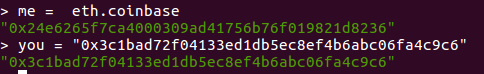
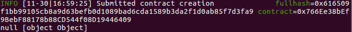
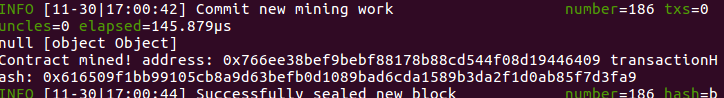
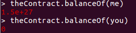
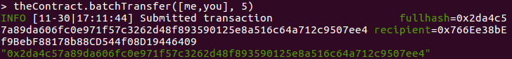
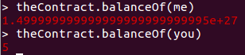
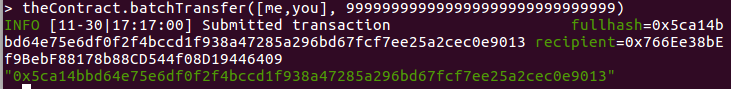
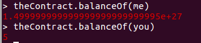
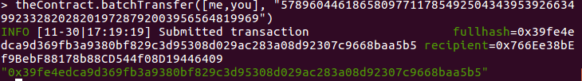
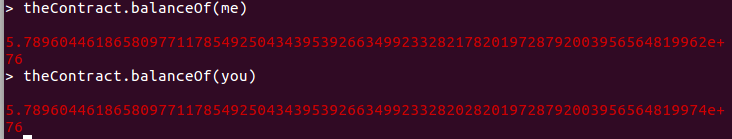

CVE-2018-19852

Contract at [0xddc36be766d4328dbf898cfd9826478659dba5c3](https://etherscan.io/address/0xddc36be766d4328dbf898cfd9826478659dba5c3) which was created at transaction [0x9fdd69d975dab181366375482e859effb63e2b796ef1d2be9d92e3227242e5da](https://etherscan.io/tx/0x9fdd69d975dab181366375482e859effb63e2b796ef1d2be9d92e3227242e5da) has an integer overflow vulnerability. Any attacker can exploit this vulnerability to arbitrarily add balance to his account.

Since this contract has no source code available, we will proof the vulnerability via the POC below.

Proof of Concept
---------------
 For convenience, we will refer to the two addresses in this experiment as `you` and `me`.
 
 
 
 First, we create a contract named `theContract` in our private chain using the same bytecode as the contract [0xddc36be766d4328dbf898cfd9826478659dba5c3](https://etherscan.io/address/0xddc36be766d4328dbf898cfd9826478659dba5c3). (the owner of contract is `me`)

 
 
 
  
 After the contract being mined, check the balance of `you` and `me`.
 
 
 
 The flawed function `batchTransfer(address[] _receivers, uint256 _value)` has the effect of transferring the amount of `_value` to each member of `_receivers` and deducting the corresponding balance from the caller's account.
 
 Now we call this function (as `me`) with a small `_value`.
 
 
 
 
 
 From the change of balances we can infer that the function works normally.
 
 Then call it with a huge `_value`.
 
 
 
 
 
 The account balance was found to have no change because the caller (`me`) has insufficient account balance， which means this function checks whether the balance of caller is enough.
 
 However, when call it with a well-constructed `_value`
 
 
 
 
 
 The huge `_value` was transferred to `you` and `me`, indicating that the checking mechanism in the function was bypassed, as the result of integer overflow.
